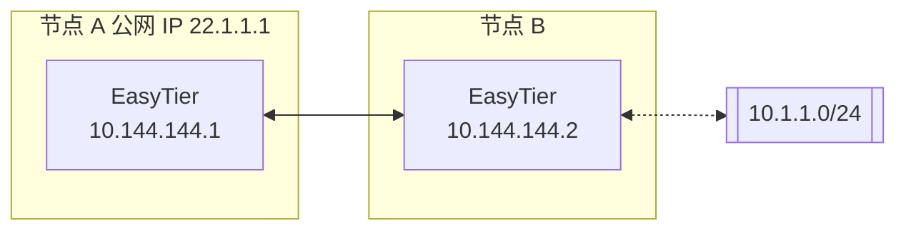
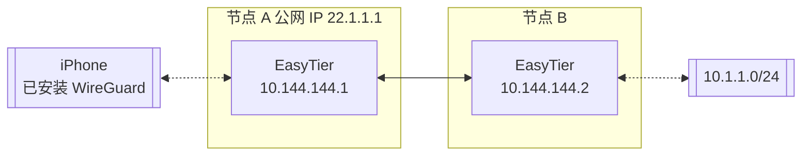

# EasyTier

[](https://github.com/229033891/EasyTier/releases)
[](https://github.com/229033891/EasyTier/blob/main/LICENSE)
[](https://github.com/229033891/EasyTier/commits/main)
[](https://github.com/229033891/EasyTier/issues)
[](https://github.com/229033891/EasyTier/actions/workflows/linux.yml)
[](https://github.com/229033891/EasyTier/actions/workflows/windows.yml)
[](https://github.com/229033891/EasyTier/actions/workflows/test.yml)

[简体中文](/README_CN.md) | [English](/README.md)

> ✨ 一个由 Rust 和 Tokio 驱动的简单、安全、去中心化的异地组网方案

Release、CI 产物与 Docker 镜像（`ghcr.io/229033891/et`）均由**本仓库**发布。

<p align="center">


</p>

📝 **[下载发布版本](https://github.com/229033891/EasyTier/releases)** | 🐳 **[Docker Compose](./docker-compose.yml)** | 📖 **[文档索引](./docs/README.md)**

## 特性

### 核心特性

- 🔒 **去中心化**：节点平等且独立，无需中心化服务
- 🚀 **易于使用**：支持通过网页、客户端和命令行多种操作方式
- 🌍 **跨平台**：支持 Win/MacOS/Linux/FreeBSD/Android 和 X86/ARM/MIPS 架构
- 🔐 **安全**：AES-GCM 或 WireGuard 加密，防止中间人攻击

### 高级功能

- 🔌 **高效 NAT 穿透**：支持 UDP 和 IPv6 穿透，可在 NAT4-NAT4 网络中工作
- 🌐 **子网代理**：节点可以共享子网供其他节点访问
- 🔄 **智能路由**：质量优先选路（延迟/丢包/抖动）与自动路由选择，提供最佳网络体验
- ⚡ **高性能**：整个链路零拷贝，支持 TCP/UDP/WSS/WG 协议

### 网络优化

- 📊 **UDP 丢包抗性**：KCP/QUIC 代理在高丢包环境下优化延迟和带宽
- 🔧 **Web 管理**：通过 Web 界面轻松配置和监控
- 🛠️ **零配置**：静态链接的可执行文件，简单部署

## 快速开始

### 📥 安装

选择最适合您需求的安装方式：

Linux（推荐 — 交互式控制台 / 节点 / 轻量 core）：
```bash
# clone 后本地执行（最稳）
git clone https://github.com/229033891/EasyTier.git
cd EasyTier
sudo bash script/install.sh
```

Windows（推荐，请以管理员权限运行）：
```powershell
irm "https://github.com/229033891/EasyTier/blob/main/script/install.ps1?raw=true" | iex
```

Linux 一键安装（从 [Releases](https://github.com/229033891/EasyTier/releases) 拉最新包；无 TTY 时默认 core）：
```bash
curl -fsSL "https://github.com/229033891/EasyTier/raw/main/script/install.sh" | sudo bash -s install
```

Linux 升级（独立脚本 `update.sh`，与 `install.sh` 互不调用；同样读 Releases）：
```bash
# clone 仓库后
cd EasyTier
sudo bash script/update.sh

# 非交互
sudo bash script/update.sh --auto
```

说明：`install.sh` 负责安装/备份/恢复/卸载；`update.sh` 负责升级；二者共用 `script/et-ops-common.sh`。详见 [部署说明](./docs/ops/deploy-install.md)。

Homebrew（MacOS/Linux）：
```bash
brew tap brewforge/chinese
brew install --cask easytier-gui
```

通过 cargo 安装（最新开发版本）：
```bash
cargo install --git https://github.com/229033891/EasyTier.git easytier
```

[预编译文件](https://github.com/229033891/EasyTier/releases) · [部署说明](./docs/ops/deploy-install.md) · [Docker Compose](./docker-compose.yml)（`ghcr.io/229033891/et`）

### 🚀 基本用法

#### 使用共享节点快速组网

EasyTier 支持使用共享节点快速组网。当您没有公网 IP 时，可以使用公共共享节点。节点会自动尝试 NAT 穿透并建立 P2P 连接。当 P2P 失败时，数据将通过共享节点中继。

使用共享节点时，每个进入网络的节点需要提供相同的 `--network-name` 和 `--network-secret` 参数作为网络的唯一标识符。

以两个节点为例（请使用更复杂的网络名称以避免冲突）：

1. 在节点 A 上运行：

```bash
# 以管理员权限运行
sudo easytier-core -d --network-name abc --network-secret abc -p tcp://<共享节点IP>:11010
```

2. 在节点 B 上运行：

```bash
# 以管理员权限运行
sudo easytier-core -d --network-name abc --network-secret abc -p tcp://<共享节点IP>:11010
```

执行成功后，可以使用 `easytier-cli` 检查网络状态：

```text
| ipv4         | hostname       | cost  | lat_ms | loss_rate | rx_bytes | tx_bytes | tunnel_proto | nat_type | id         | version         |
| ------------ | -------------- | ----- | ------ | --------- | -------- | -------- | ------------ | -------- | ---------- | --------------- |
| 10.126.126.1 | abc-1          | Local | *      | *         | *        | *        | udp          | FullCone | 439804259  | 2.6.2-70e69a38~ |
| 10.126.126.2 | abc-2          | p2p   | 3.452  | 0         | 17.33 kB | 20.42 kB | udp          | FullCone | 390879727  | 2.6.2-70e69a38~ |
|              | PublicServer_a | p2p   | 27.796 | 0.000     | 50.01 kB | 67.46 kB | tcp          | Unknown  | 3771642457 | 2.6.2-70e69a38~ |
```

您可以测试节点之间的连通性：

```bash
# 测试连通性
ping 10.126.126.1
ping 10.126.126.2
```

注意：如果无法 ping 通，可能是防火墙阻止了入站流量。请关闭防火墙或添加允许规则。

为了提高可用性，您可以同时连接多个共享节点：

```bash
# 连接多个共享节点
sudo easytier-core -d --network-name abc --network-secret abc -p tcp://<公共节点IP>:11010 -p udp://<公共节点IP>:11010
```

自建中继时请填写**完整隧道 URL**（scheme/主机/端口/path）。**443 不一定可用**——许多网络会阻断 443 或只放行特定端口：

```bash
# 自定义端口（443 不可用时）
-p wss://relay.example.com:8443/et
-p tcp://relay.example.com:5000

# 443 可用时的推荐示例（合法证书）
-p wss://relay.example.com/et
```

多条 `-p` / `[[peer]]` 会全部维持连接，实际走哪条按延迟/抖动/丢包质量自动选择。

#### 去中心化组网

EasyTier 本质上是去中心化的，没有服务器和客户端的区分。只要一个设备能与虚拟网络中的任何节点通信，它就可以加入虚拟网络。以下是如何设置去中心化网络：

1. 启动第一个节点（节点 A）：

```bash
# 启动第一个节点
sudo easytier-core -i 10.144.144.1
```

启动后，该节点将默认监听以下端口：
- TCP：11010
- UDP：11010
- WebSocket：11011
- WebSocket SSL：11012
- WireGuard：11013

2. 连接第二个节点（节点 B）：

```bash
# 使用第一个节点的公网 IP 连接
sudo easytier-core -i 10.144.144.2 -p udp://第一个节点的公网IP:11010
```

3. 验证连接：

```bash
# 测试连通性
ping 10.144.144.2

# 查看已连接的对等节点
easytier-cli peer

# 查看路由信息
easytier-cli route

# 查看本地节点信息
easytier-cli node
```

更多节点要加入网络，可以使用 `-p` 参数连接到网络中的任何现有节点：

```bash
# 使用任何现有节点的公网 IP 连接
sudo easytier-core -i 10.144.144.3 -p udp://任何现有节点的公网IP:11010
```

### 🔍 高级功能

#### 子网代理

假设网络拓扑如下，节点 B 想要与其他节点共享其可访问的子网 10.1.1.0/24：



要共享子网，在启动 EasyTier 时添加 `-n` 参数：

```bash
# 与其他节点共享子网 10.1.1.0/24
sudo easytier-core -i 10.144.144.2 -n 10.1.1.0/24
```

子网代理信息将自动同步到虚拟网络中的每个节点，每个节点将自动配置相应的路由。您可以验证子网代理设置：

1. 检查路由信息是否已同步（proxy_cidrs 列显示代理的子网）：

```bash
# 查看路由信息
easytier-cli route
```


2. 测试是否可以访问代理子网中的节点：

```bash
# 测试到代理子网的连通性
ping 10.1.1.2
```

#### WireGuard 集成

EasyTier 可以作为 WireGuard 服务器，允许任何安装了 WireGuard 客户端的设备（包括 iOS 和 Android）访问 EasyTier 网络。以下是设置示例：



1. 启动启用 WireGuard 门户的 EasyTier：

```bash
# 将一个 WireGuard 客户端注册为虚拟 peer 10.144.144.3
sudo easytier-core -i 10.144.144.1 \
  --network-secret portal-secret \
  --vpn-portal wg://0.0.0.0:11013 \
  --vpn-portal-private-key "$(wg genkey)" \
  --vpn-portal-client phone=10.144.144.3
```

2. 获取 WireGuard 客户端配置：

```bash
# 获取 WireGuard 客户端配置
easytier-cli vpn-portal
```

3. 如果输出配置中的 `Peer.Endpoint` 是通配地址，将其替换为 EasyTier
   节点的公网 IP/域名后即可导入。`Interface.Address` 只是客户端本地地址，
   可以改为任意 IPv4 地址；EasyTier 会把它转换成已注册的虚拟 peer 地址。

#### 自建公共共享节点

您可以运行自己的公共共享节点来帮助其他节点相互发现。公共共享节点只是一个普通的 EasyTier 网络（具有相同的网络名称和密钥），其他网络可以连接到它。

要运行公共共享节点：

```bash
# 公共共享节点无需指定 IPv4 地址
sudo easytier-core --network-name mysharednode --network-secret mysharednode
```

网络设置成功后，您可以配置它以在系统启动时自动启动。请参阅 [部署说明](./docs/ops/deploy-install.md) 了解如何安装并将 EasyTier 注册为系统服务。

## 相关项目

- [ZeroTier](https://www.zerotier.com/)：用于连接设备的全球虚拟网络。
- [TailScale](https://tailscale.com/)：旨在简化网络配置的 VPN 解决方案。

### 联系方式

- 🐛 **[Issues](https://github.com/229033891/EasyTier/issues)**

## 许可证

EasyTier 在 [LGPL-3.0](https://github.com/229033891/EasyTier/blob/main/LICENSE) 许可下发布。

## 使用规范

请仅将 EasyTier 用于合法用途，并遵守适用的法律法规。使用者有责任确保其已获授权连接和管理相关网络与设备。
