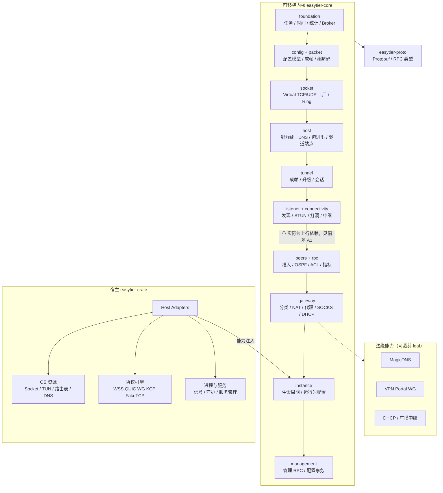
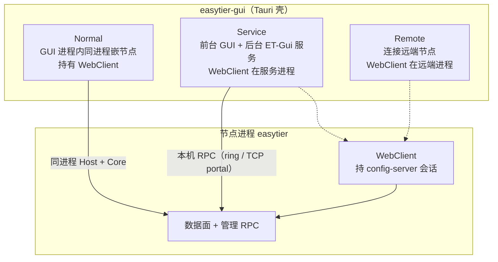
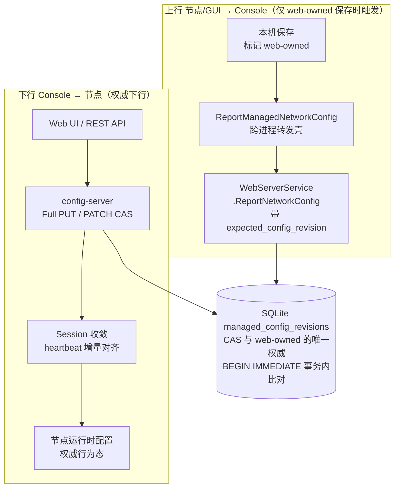
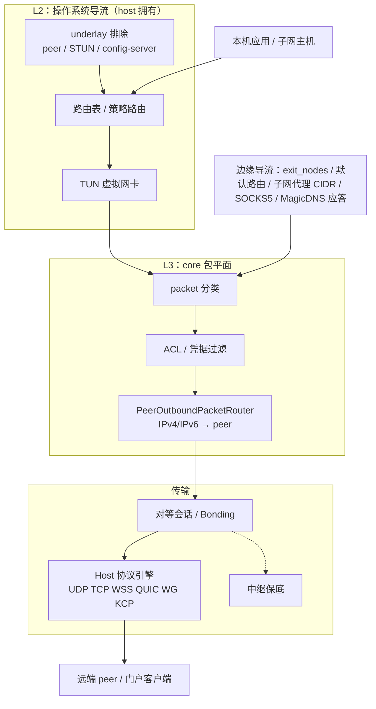
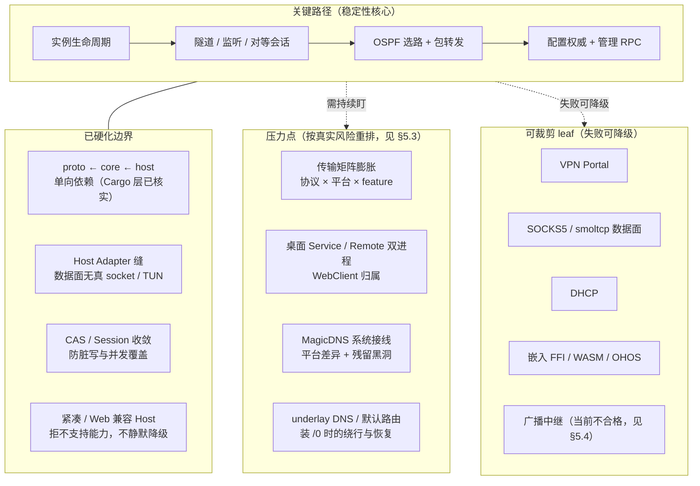

# EasyTier 架构总览与稳定性评估（中文）

## Status

- Status: **Current**
- 最近审阅：2026-10-10
- 读者：实现复查 / 架构评审 / 其他 agent
- 索引：[`../README.md`](../README.md)
- 系统地图入口：[`system-overview.md`](./system-overview.md)
- 边界与所有权的**英文 SoT**：[`architecture.md`](./architecture.md)

## 本文定位

本文与 [`architecture.md`](./architecture.md) **不重复**，分工如下：

| 文档 | 回答什么 | 权威性 |
|------|----------|--------|
| [`architecture.md`](./architecture.md) | 模块归谁、依赖方向、16 条不变量、验证基线 | **所有权 SoT**；改语义时改它 |
| [`system-overview.md`](./system-overview.md) | 系统怎么串起来 + 阅读顺序 | Agent 入口地图 |
| **本文** | 架构**合理性评估** + 已核实的偏差与缺陷 | 评审输入；结论带 file:line |

本文所有判断均在 2026-10-10 对工作区代码逐条核对得出，证据以 `文件:行` 给出。
凡本文与 `architecture.md` 冲突，**以 `architecture.md` 为准**，并视为待修的文档偏差（见 §8）。

---

## 1. 分层

### 1.1 依赖方向（已核实成立）

```text
easytier-proto  ←  easytier-core  ←  easytier
```

`easytier-proto` 不依赖任何 `easytier*` crate；`easytier-core/Cargo.toml:36` 是唯一指向 proto 的边，且
`default-features = false` + 仅 `core` feature。`easytier-core` 内全量 grep `easytier::` **0 命中**。
`easytier-web`、`easytier-gui/src-tauri`、`easytier-contrib/*` 均在三者之上。**无环、无反向依赖。**

### 1.2 core 内部层序

```text
foundation ← config/packet ← socket ← host ← tunnel ← listener/connectivity
          ← peers/rpc ← gateway ← instance ← management
```

`wasi` 是目标集成，不是额外的可移植域层（`architecture.md:149-151`）。

### 1.3 Host Adapter 缝

`easytier-core/src/host/` 是 **trait 定义 + 桥接器**，不含真实 OS 实现；
生产实现集中在 `easytier-core/src/wasi/adapter/`，整个模块被
`cfg(any(test, target_os = "wasi"))` 隔离（`easytier-core/src/wasi/mod.rs:11-26`）。



### 1.4 分层结论

主骨架合理、边界清楚。数据面（`instance` / `gateway` / `peers` / `connectivity` / `listener` / `tunnel`）
**不触碰 OS**：全量 grep `tun_device` / `Set-NetRoute` / `netsh` / `netlink` / `socket2` / `libc` / `nix` 在
core 内 **均 0 命中**；core 的 `add_route` 全是内部 peer route 表，与 OS 路由表无关。

破口只有 2 处，都在 management 平面，见 §8 偏差 A2。

---

## 2. 交付切分

### 2.1 三件可交付物

| 产物 | 职责 | 由谁编出 |
|------|------|----------|
| 节点进程 | P2P VPN 数据面 + 本机管理 RPC | `easytier` crate（`src/core.rs` 走 CLI 分支） |
| `easytier-web` | Console 集中配置 + config-server + 浏览器 UI | `easytier-web` crate |
| `easytier-gui` | Tauri 本机壳 + 可选 `ET-Gui` 服务 | `easytier-gui/src-tauri` |

三者职责分离清晰，可独立演进：节点不感知 GUI，GUI 不含数据面策略，Console 不含数据面。

### 2.2 桌面三种模式

代码里是**三种**，不是两种。Remote 模式此前未进 Current 文档，见 §8 偏差 B1。



关键事实：

- Normal 模式下 WebClient 在 GUI 进程：`easytier-gui/src-tauri/src/lib.rs:82`
  （`WEB_CLIENT` 进程级 `LazyLock`），构造于 `:865`，写入于 `:879`。
- Service 模式下 **GUI 主动丢弃自己的 WebClient**：`lib.rs:814-823`
  （`drop(WEB_CLIENT.write().await.take())` + `retain_network_instances(&[])`）。
- Service 模式的 WebClient 在 **ET-Gui 服务进程**内构造：`easytier/src/core.rs:1625-1650`。
- 切模式时前端也停掉 init：`easytier-gui/src/pages/index.vue:797-817`。

---

## 3. 配置权威

### 3.1 两条方向（勿混）



> 运行时配置启动后会把状态只读回显给 Web UI（图中省略该回显边：它会反转下行泳道方向）。
> 完整上下行语义见 [`web-managed-config.md`](./web-managed-config.md) 与
> [`desktop-gui-and-config-server.md`](./desktop-gui-and-config-server.md)。

### 3.2 CAS 权威在数据库事务，不在应用层锁

- 版本表 `managed_config_revisions (user_id, device_id, config_revision)`：
  `easytier-web/src/db/entity/managed_config_revisions.rs:7`
- 比较与判定：`easytier-web/src/db/mod.rs:1130-1250`
  - `:1165` `BEGIN IMMEDIATE`
  - `:1170-1175` 事务内重读；相同即 `AlreadyApplied`（幂等）
  - `:1176-1185` 不等即 `RevisionConflict`
  - `:1227-1247` 目标行 `source != Web` 即 `OwnershipConflict`（web-owned 标记的强制点）
- HTTP 侧 409 + `current_config_revision`：`easytier-web/src/restful/network.rs:118-147`
  路由定义 `:495-504`（PUT = Full reconcile，PATCH = CAS）
- Session 收敛：`easytier-web/src/client_manager/session/runtime_revision.rs:59-185`

### 3.3 客户端侧并发栅栏

`easytier-core/src/management/full/web_client.rs:280-354`：

- `managed_config_revision`（`:284`）缓存，**唯一写入来源是 heartbeat 响应**（`:846` → `:878-881`）
- `revision_generation`（`:288`）防止旧 heartbeat 覆盖新 report（`:319-324`）
- `pending_report`（`:294`、`:330-347`）让同一次编辑的重试复用同一 target revision，保证 Console 侧幂等

### 3.4 上行是单向、且只在「用户主动保存」时触发

`ReportManagedNetworkConfig` 只是跨进程转发壳（`easytier-core/src/management/full/process_rpc.rs:821-836`）；
真正携带 `expected_config_revision` / `config_revision` 的 CAS 消息是
`WebServerService.ReportNetworkConfig`（`easytier-proto/proto/web.proto:51-69`）。

唯一调用点：`save_network_config`（`easytier-gui/src-tauri/src/lib.rs:383` → `:394-440`）。
**不在** heartbeat、**不在**实例自动运行时上报。

### 3.5 冲突策略

冲突时**保留本地编辑**，提示重试或从 Console 重载
（`easytier-core/src/management/full/config_server_client.rs:108-111`）。
这是合理取舍：Console 是权威但不应吞掉用户刚做的编辑。

---

## 4. 流量模型

L2（操作系统导流）与 L3（core 选路）分离，与 TUN / 出口 / 子网代理模型一致。



模型评价：合理。`exit_nodes` 的 `/0` 与 OSPF 学到的路由**不同源**（前者本机策略，后者对端宣告），
在 L2/L3 交界处分开，避免了"谁该装 /0"的歧义。

---

## 5. 稳定性评估

这是本文的核心新增价值。`architecture.md` 有 16 条不变量与 4 条已登记债务，
但**没有对压力点的兜底强度做过评级**。

### 5.1 稳定性地图



### 5.2 偏稳的部分

| 项 | 依据 |
|----|------|
| 单向分层 | Cargo 层零反向依赖；core 内无 `easytier::` 引用 |
| Host Adapter 缝 | 数据面无 TUN / 路由 / socket2 / libc；生产实现在 `wasi/adapter/` 且目标隔离 |
| 管理面 CAS / Session | DB 事务为权威 + 客户端 generation 栅栏 + 幂等 pending_report |
| 关键路径短 | 实例 → 隧道/对等 → OSPF/转发 → 管理 RPC，无多余中转层 |
| 冲突策略 | 保留本地编辑，不静默丢用户改动 |

### 5.3 压力点真实风险排序（与直觉相反）

**直觉排序**：桌面双进程 > 默认路由 > MagicDNS > 传输矩阵。
**实际兜底强度**（越高越安全）：

| 压力点 | 兜底强度 | 证据 |
|--------|----------|------|
| **默认路由 / underlay** | **最高** | 五重保护齐备：期望集合过滤 → 高度量逃生阀 → 幂等冲突重试 → 装卸顺序保证 → 显式恢复清理。`cidr_monitor.rs:388-503` 13 个单测（含 `exit_nodes_install_local_default_without_manual_routes` `:388`、`clearing_exit_nodes_drops_only_the_local_default` `:438`）、`underlay_exclude.rs:113-135`、ifcfg/netlink 5 个。唯一有 Current + Roadmap + Archive **三层文档闭环**的主题。 |
| **MagicDNS 接线** | 中高 | `os_wired.rs:34-48` 三态往返测试；平台专属仅 win / linux / macOS-非NE 三路 SystemConfig；`Ok(None)` 保持 `None` 不误报 false，降级**有信号**；前端五态徽章。缺口：Windows 测试被 `#[cfg(target_os="windows")]` 门控，非 Windows runner 不编译不运行（`windows.rs:220-256`）；Android/iOS/OHOS 接线**零测试**。 |
| **桌面双进程** | 中 | 文档完备（`desktop-gui-and-config-server.md:18-44`），但**运行期无跨进程互斥**：`DaemonGuard` 仅进程内（`manager.rs:191-201`），"GUI 与 ET-Gui 同时持有同 config-dir 实例"无代码级拒绝。测试为零。**且已发现实害缺陷，见 §8 偏差 D1。** |
| **传输矩阵** | 中（已改善） | `#[cfg(target_os)]` 352 处、`#[cfg]` 共 1435 处；6 scheme × 7 平台 × feature 子集。**已修**：① CI 补上 `pull_request` 触发（`test.yml` 顶层 `on:` 原本只有 `push: releases/**`，但 `pre_job` 早已写好 `github.event_name == 'pull_request'` 的路径过滤分支——触发器是漏的，现已补齐）；② `three_node.rs` 补 `quic` / `faketcp` 端到端用例，并为这两种 scheme 补齐监听（11012 / 11013）。仍缺：CI 仍是单 runner ubuntu，无真正的协议 × 平台矩阵。 |

**结论**：默认路由是最不该动的模块；传输矩阵是最该补测试的模块。两者的直觉排序恰好相反。

### 5.4 能力裁剪质量

| leaf | 是否真 leaf | 依据 |
|------|-------------|------|
| VPN Portal | ✅ | `vpn-portal` 独立 feature（隐含拉起 `wireguard` 引擎，注意耦合） |
| SOCKS5 / smoltcp 数据面 | ✅ | `proxy-smoltcp-stack` / `proxy-packet` 独立 |
| DHCP | ✅ | `dhcp-ipv4` 独立 |
| MagicDNS | ✅ | `magic-dns` 独立 |
| 嵌入 FFI / WASM / OHOS | ✅ | 编译期边界隔离 |
| **广播中继** | ❌ | `easytier-core/src/instance/mod.rs:24` 是 `all(windows, feature = "tun")` **编译期绑定**，无独立开关。要真正可裁剪需新增独立 feature。 |

---

## 6. 测试与验证现状

| 区域 | 覆盖 |
|------|------|
| CAS / managed config | **良好**：`managed_config.rs` 17 个测试（13 个相关，含 `report_client_web_config_cas_success_and_conflict` `:1416`）、`runtime_revision.rs` 27 个、`session.rs` 31 个、`web_client.rs` 15 个、`db/mod.rs` 9 个 |
| 默认路由 | **良好**：`cidr_monitor.rs` 13 个 + `underlay_exclude.rs` 3 个 + netlink 5 个 |
| 传输协议 | 中：CI 已挂 `pull_request`；`quic` / `faketcp` 补了端到端用例（Linux netns 集成套件）。仍无协议 × 平台矩阵 |
| 桌面双进程 / WebClient 归属 | **弱**：`lib.rs` 有 `rpc_connect_budget_tests` 3 个 + `web_owned_report_tests` 5 个（覆盖 D1 修复的判定表）；`manager.rs:718+` 6 个只覆盖 `PersistedConfigSource` 枚举序列化与合并。**仍缺**跨进程归属切换本身（Normal↔Service↔Remote）的测试 |
| 移动端 MagicDNS 接线 | **零**（仅 JNI 回填入口 `easytier-android-jni/src/lib.rs:295-304`） |

验证基线（`architecture.md:525-544`）：

```text
cargo fmt --all -- --check
cargo check -p easytier-core -p easytier-proto -p easytier --features full
cargo test -p easytier-core --lib
```

---

## 7. 关于原 `.tmp/architecture-diagrams/` 图集（已删除）

该图集曾含 7 张主题图 + svg/png，**被 `.gitignore` 排除、不在版本库、无 owner**，
其 README 自述「设计草案，非正式 Current 文档」。核对结果是 7 张里 6 张已被 Current 文档覆盖
且更权威，唯一有独立价值的 `stability-map` 已落地为本文 §5。
因此 **2026-10-10 已整目录删除**（22 文件 / ~435 KB）；本文 §1–§5 的内嵌 mermaid
是修正后的版本（改对了 `PEER → CONN` 箭头方向、补了 Remote 模式、修了两处布局）。

删除前的覆盖对照，留档备查：

| 原图 | 是否已被 Current 文档覆盖 |
|------|--------------------------|
| `layered-architecture` | 已覆盖（`architecture.md` §Crate dependency direction / §Internal core layers / §Module boundaries），本文 §1 补中文视图与修正 |
| `core-domains` | 已覆盖（`architecture.md` §Internal core layers + 各域章节），图是粗粒度子集 |
| `runtime-topology` | 已覆盖（`system-overview.md` §1），本文 §2 补 Remote 模式 |
| `config-authority` | 已完全覆盖（`web-managed-config.md` + `desktop-gui-and-config-server.md`），本文 §3 补链路细节 |
| `traffic-path` | 已覆盖（`traffic-steering.md`），本文 §4；underlay 细节见 [`underlay.md`](./underlay.md) |
| `functional-structure` | 部分覆盖；需防过度宣称（Bonding 默认值，见 §8 偏差 B3） |
| **`stability-map`** | **无权威版本** —— 本文 §5 即其落地 |

---

## 8. 已核实的偏差与缺陷

### A. 分层类偏差

#### A1. 图中 `PEER --> CONN` 箭头方向与代码相反

`connectivity` 实际**依赖** `peers`：

- `easytier-core/src/connectivity/hole_punch/peer_adapters.rs:31-183` — 直接 concrete 命名 `PeerManagerCore`，实现 6 个 trait
- `easytier-core/src/connectivity/direct/mod.rs:32,168,207` — 字段直接是 `Arc<PeerManagerCore>`
- `easytier-core/src/connectivity/manual/mod.rs:29,377,430` — 同上
- `easytier-core/src/connectivity/manual/mod.rs:845,920` — 直接 import peers 的错误分类

已登记为债务（`architecture.md:552-554`），但原图未体现，反而强化了"分层很干净"的印象。
**本文 §1.3 的图已标注该实际方向。**

#### A2.（**已修复**）core 曾有两处真实 OS 破口，违反 invariant #2

`architecture.md:502-503` 明确禁止 core 做真实 OS 操作，原先有两处破口：

| 位置 | 原行为 | 修法 |
|------|--------|------|
| `management/full/config_server_status.rs` | `tokio::net::lookup_host(...)` 直接走系统 resolver（仅当 host 未注册 `set_host_dns_lookup` 时触发） | 删掉兜底。未注册 resolver 视为**查询失败**，走与超时/报错完全相同的 stale 缓存降级路径，并 `warn!`。三处降级逻辑抽成 `extend_from_dns_fallback` |
| `instance/manager.rs` | `std::fs::read_to_string` / `write` 直接读写 `config_dir/.user-disabled-web-instances` | 新增 `UserDisabledWebInstanceStore` 缝，store 由 Host 注入；无 store 时集合仅驻内存（紧凑 / 嵌入 Host 的正确默认） |

`UserDisabledWebInstanceStore` 定义在 `instance` 而非复用 `management::ConfigFileStorage`，
因为 `management` 在层序上**高于** `instance`，不能被反向依赖。
native 实现 `NativeUserDisabledWebInstanceStore` 委托给既有的 `NativeConfigFileStorage`，
因此原子替换与 0600 权限语义与实例 TOML 文件一致。

验证：`easytier-core/src` 全量 grep `std::fs::` / `tokio::net::` / `std::process::Command` **0 命中**。

#### A3.（**已订正**）`host/socket/*` 那一族 trait 目前只有 WASI 有生产消费者

native 路径**不实现** `HostSocketIo` / `HostTcpIo` / `HostUdpIo` / `HostSocketFactoryIo` / `HostTunnelIo`
（`easytier/src/` 全量 grep 0 命中），走的是上一层的 `socket\` trait：
`easytier/src/host_runtime.rs` 实现 `VirtualTcpSocketFactory` /
`VirtualTcpListenerFactory` / `VirtualUdpSocketFactory` / `DnsResolver`。

含义：图上 `ADAPT -->|"能力缝"| INST` 在 native 上对应 `socket\`，不是 `host/socket\`。

已订正：`architecture.md` § Socket and Host seams 新增一段，明确两族 seam 并存
及其各自的生产消费者，并要求新增 socket 能力时**显式判断**目标 Host 需要哪一族——
在 native 上够 `host/socket/` 会得到一个没有实现方的缝。

#### A4.（**已订正**）`foundation` 的架构价值基本未兑现

`CONTEXT.md:1-8` 与 `architecture.md` 声明 foundation "可被任何高层使用"。实际：

- core 内 **74 处**复用（跨 8 个域）—— 成立
- core 外**仅 1 处**生产使用：`easytier/src/gateway/quic_proxy.rs`（`ExpiringSet`）
- `easytier-web` / `easytier-gui` / `easytier-contrib` 全部 **0 处**

不是分层违规（`pub` 确实可见），但"公共基础设施层"目前只是一个 core 内部约定。

已订正：`architecture.md` § Foundation 改为明确它是 **core 内部**基础层，
并写明规则——新增跨 crate 使用时应当是"有意识地把它变成公开 API"的决策，
在只有一个消费者前，优先复制一个小helper 而非无谓扩大公开面。

---

### B. 图 / 文档 / 代码三方冲突

#### B1.（**已订正**）桌面有第三种模式 Remote，文档只写了两种

- 代码有：`easytier-gui/src-tauri/src/lib.rs`（`set_tun_fd is not supported in remote mode`、service / remote 合并表述）
- 原文档只写 Normal / Service：`desktop-gui-and-config-server.md`
- 原图只画两种：`runtime-topology.mmd` 的 `DESK_MODE` 子图

已订正：`desktop-gui-and-config-server.md` 增加 Remote 模式说明，
本文 §2.2 的图与表也改为三态。语义上 Remote 与 Service 一致
（config-server `WebClient` 都在别的进程，GUI 只走 RPC），
但三者必须都写出来，否则复查会只查 GUI 进程内的 `WEB_CLIENT`。

#### B2.（**图侧已修**）`easytier-cli` 被画在呈现层，实际属 Host 层

原图 `layered-architecture.mmd` 把 CLI 放在"呈现与管理层"，
但 `architecture.md:114-126` 与 `product-map.md:121` 明确 CLI 由 `easytier` crate 编出、属 Host/native 层。

本文 §1.3 的图已把 CLI 归入宿主层（未单列）。原始 `.mmd` 仍需同步，见 §7。

#### B3.（**图侧已修**）Bonding 在功能树里像常规功能

`functional-structure.mmd` 把"多链路 Bonding"与"集中管理"并列在功能顶层，
易被读成默认开启。实际默认 `bond_count=1`（`peer-connections.md:35`），
且 `peer-connections.md:114` 明确"勿写默认已聚合"。

本文不含功能树图，引用该结论时以 `peer-connections.md` 为准。
原始 `.mmd` 仍需同步，见 §7。

#### B4.（**已解决**）三方缺 underlay 权威页

原先 `underlay` 横跨 **9 个文件 / 4 个 docs 分区**，且 Current 两处措辞不一致
（`traffic-steering.md:61` vs `socket-protection.md:37-43`），
最大的 Android underlay 风险被放在 `ops/android-startup-auto-stop.md`，
从 Agent 入口 `system-overview.md` 不可达。

已新建 [`underlay.md`](./underlay.md) 作为 underlay 主题的 Current SoT。写作时发现一个
此前没被记录的事实：**`underlay` 一词在仓库里指四个互不相干的概念**——
排除路由、桌面 DNS 绑定、Android 网络变化、出口多样性（未实现）。
混谈会导致把 Android 日志 `underlay network generation changed`
误判成排除路由问题。新文档 §0 先做消歧，四者各占一节，
并标注「实现覆盖差异」与已知的 route updater 收尾债。

`system-overview.md` 流量路径与阅读顺序、`docs/README.md` 索引、
`traffic-steering.md` / `socket-protection.md` 的交叉引用均已指向它。

#### B5.（**已订正**）「装 TUN `/0` 需管理员权限」只在 Roadmap

原先只有 `roadmap/discussion-proposal-2026-10.md` 与 `roadmap/traffic-steering-vNext.md` 提到，
Current `traffic-steering.md` 未写入任何权限提示 —— 对外文案会漏。

已订正：`traffic-steering.md` § 平台差异后新增「权限前提」小节，
按平台列出提权方式，并写明权限不足时的表现是**安装失败并保留原路由**，
不是静默降级为部分路由（这条对排障很关键）。

---

### C. 缺陷

#### D1.（高，**已修复**）Service / Remote 模式：web-owned 上行断链

**这不是抽象模糊，是有明确触发路径的缺陷。**

原始证据链：

1. `save_network_config` 的上报被硬门控在 GUI 本地 `storage.persisted_source`：
   ```rust
   let is_web = client_manager.storage.persisted_source(instance_id)
       .is_some_and(|source| matches!(source, PersistedConfigSource::Web));
   if !is_web { return Ok(()); }
   ```
2. `source = Web` 只能由 `pre_run_network_instance_hook` 写入 GUI 存储
   （`manager.rs:191-216`），读取见 `manager.rs:218-220`。
3. **Service 进程的 WebClient 传 `hooks = None`**：`easytier/src/core.rs:1635`
   → `easytier/src/web_client/mod.rs:66,111-114` `DefaultHooks`（空实现）
   → `easytier-core/src/management/full/process_rpc.rs:43-45` `pre_run_network_instance` 是 no-op。
4. 但 GUI 通过 `handle_list_network_instance_ids` 走 RPC **能看到并编辑**该实例。

**后果**：Console 建的网络自动跑在 ET-Gui，GUI 全程不知道它是 web-owned；
用户在 GUI 编辑保存 → 提前 return → **静默不上报 Console**，编辑只落 localStorage。

复现步骤：

1. Console 新建一个 web 托管网络，让它在 ET-Gui 自动运行
2. 不在 GUI 里启停该实例，直接在 GUI 编辑配置并保存
3. Console 侧配置不变；GUI localStorage 已改 → 双向分叉

**修法**：上报门控不再只看 GUI 本地标记，而是**先向持有该实例的进程询问权威
`ConfigSource`**，本地缓存降级为兜底。

- `GetNetworkInstanceConfigResponse` 本就带 `source` 字段；
  `handle_get_network_config_with_source`
  （`easytier-core/src/management/full/remote_client.rs:323`）是 **RPC 优先**的，
  在 Service / Remote 模式下正好问到 ET-Gui 或远端节点。
- 判定抽成纯函数 `should_report_to_config_server(authoritative, local)`，
  **权威优先**：owner 明确回答 `Web` 即上报；明确回答 `User` 即使本地仍是 `Web` 也不上报；
  owner 答不上来（`None`）才回落到本地缓存。
  两个方向的陈旧标记都被堵住：陈旧本地 `User` 压不住必需的上报（D1 本体），
  陈旧本地 `Web` 也压不住明确的 `User` 回答——后者若不堵，de-web 后的配置每次保存
  都会上报并吃一个 `OwnershipConflict` 弹窗（本地标记经 `merge_persisted` 只朝 `Web`
  单向粘滞，永远回不来）。缺省 / `Unspecified` 的 RPC source 经 `config_source_from_rpc`
  解码为 `None` 而非 `User`，随后 owner 侧 `handle_get_network_config_with_source`
  （`remote_client.rs:344`）会**回退去读自己的 storage source**——所以旧 runtime 不会误
  触发明确-`User` 分支。`authoritative` 真正为 `None` 只发生在 **RPC 调用失败**（owner
  答不上来）时，也正是这时才回落到 GUI 本地缓存。
- 锁获取失败或 RPC 不可用时**跳过上报而非报错**——本地保存此时已成功，
  把它变成失败会让用户看到"保存失败"的假象。
- **没有**选择给服务进程补 `GuiHooks`：服务进程拿不到 GUI 的 `AppHandle`，
  补了也发不出事件；且 GUI 本地存储仍可能与权威侧不一致，hooks 只会掩盖问题。

回归测试：`web_owned_report_tests`（7 个用例：权威 Web 覆盖本地缺失 / 覆盖陈旧 User、
权威 User 覆盖陈旧本地 Web / 权威 User 且无本地标记不上报、本地 Web 兜底、
User 与 Legacy 不上报、未知归属不上报）。

#### D2.（中）服务重启后首帧 CAS 竞态

`WebClient` 构造时 `managed_config_revision: StdMutex::new(None)`（`web_client.rs:422`），
**只在 heartbeat 响应里填充**（`web_client.rs:878-881`）。
服务刚重启、首帧 heartbeat 未回来时用户保存 web 配置 → `expected = ""`（`web_client.rs:506`）
→ Console 侧 `managed_config.rs:310-314` 判 `current(Some) != expected(None)` → **假 `revision_conflict`**。

已有缓解（保留本地编辑 + 提示重试，`config_server_client.rs:108-111`），
heartbeat 后重试即成功。属于可接受但应在文档写明的行为。

#### D3.（低）GUI 陈旧副本可回灌进服务 config-dir

`manager.rs:643-695` `load_configs` 会把 **localStorage 的副本**用
`RunNetworkInstance { overwrite: false, source: <本地 source> }` 回灌到服务进程（`:670-688`）。
`process_rpc.rs:262-264` 在实例健康且 `overwrite=false` 时短路；
但若实例缺失或带 `error_msg`，则走 `:265-283` → 把 GUI 侧（可能陈旧）的 web 副本
写入服务 config-dir 且 `source=Web`，此后又会被当成权威回写 Console。

触发面被 `index.vue:796`（只传当前 running ids）+ `manager.rs:662`（只处理 enabled）双重收窄，属窄窗口。

---

## 9. 建议处理顺序

| 优先级 | 事项 | 性质 |
|--------|------|------|
| ~~P0~~ ✅ | D1 Service/Remote web-owned 上行断链 | **已修复**（§8 C D1），21 个 GUI 测试全绿 |
| ~~P1~~ ✅ | A2 core 两处 OS 破口 | **已修复**（§8 A2）；core 内 `std::fs` / `tokio::net` / `Command` 已 0 命中 |
| ~~P1~~ ✅ | R4 传输矩阵 | **已修**：CI 补 `pull_request` 触发；补 `quic` / `faketcp` 端到端用例与监听 |
| P2 | R4 余项：CI 仍是单 runner ubuntu，补协议 × 平台矩阵（QUIC/faketcp 用例只在 Linux 跑，Windows/macOS 仍无协议覆盖） | 测试补齐 |
| P2 | D1 手工回归：Console 建 web 网络 → ET-Gui 自动运行 → GUI 直接编辑保存 → 确认 Console 收到 | 验收 |
| P2 | 广播中继拆出独立 feature（当前挂 `proxy-packet`，host 侧 `cfg!(all(windows, feature="tun"))`） | 能力裁剪补齐；**风险 > 收益，建议暂缓**（无法在本机测试的平台） |
| ~~P3~~ ✅ | B4 underlay 权威页 | **已新建** [`underlay.md`](./underlay.md)；并记录「underlay 一词指四种互不相干概念」 |
| ~~P2/P3~~ ✅ | B1 Remote 模式、A3 两族 socket seam、A4 foundation 定位、B5 权限提示 | **已订正**（§8 A3/A4、B1/B5） |
| P3 | 原始 `.tmp` 图集同步修正后纳入 `docs/` | ~~已完成：2026-10-10 整目录删除（6/7 已被 Current 覆盖，`stability-map` 落地为 §5） |

**总体判断**：主骨架合理、边界清楚，**不应再堆一层抽象**。
稳定性取决于"关键路径保持瘦"和"压力点有文档/测试兜住"。
VPN Portal、嵌入 FFI 等失败可降级，不应拖垮组网主路径。

---

## 10. 维护

- 本文结论带 `file:line`，代码变动后需复核；`Last reviewed` 超过一个迭代应重验 §8。
- §5 的压力点排序依赖兜底强度而非直觉，新增/删除测试会改变排序。
- 本文与 `architecture.md` 冲突时以 `architecture.md` 为准，并把冲突记入 §8。
- 行为变更时：先改对应 Current 专题，再改本文；Roadmap 文不得冒充已交付。